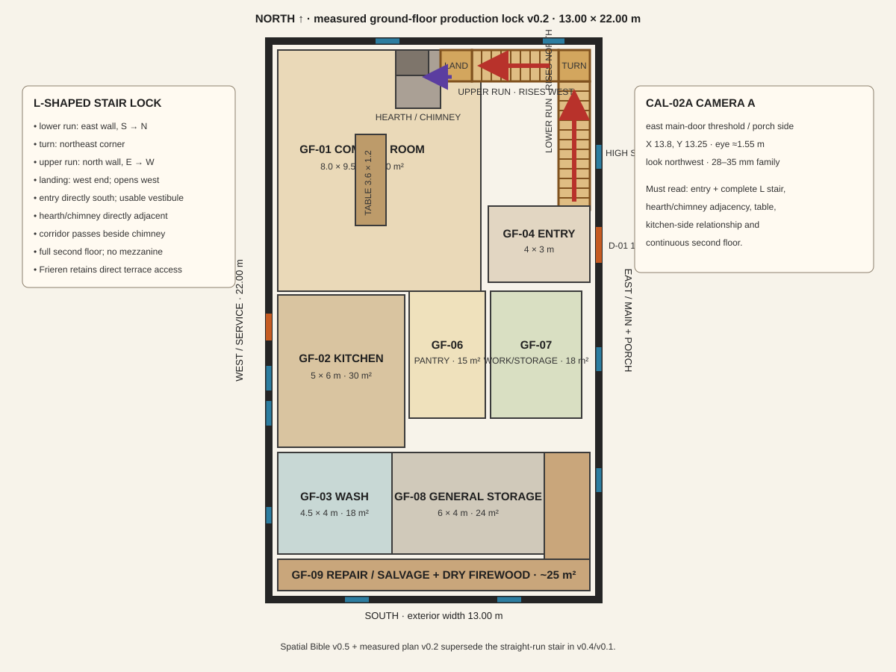

# The Arrivals — Inn Ground-Floor Measured Production Plan v0.2

**Status:** CREATOR-APPROVED SPATIAL PRODUCTION LOCK  
**Authority:** `THE_ARRIVALS_ABANDONED_VILLAGE_AND_INN_SPATIAL_BIBLE_v0.5.md`  
**Purpose:** measured ground truth for CAL-02/CAL-03 and later inn-interior production

## Drawing convention

- Southwest exterior corner = `(0,0)`; east is `+X`, north is `+Y`.
- Exterior shell: `13.00 × 22.00 m`.
- Nominal exterior walls: `0.35 m`; normal internal partitions: `0.20 m`.
- Clear interior: `12.30 × 21.30 m`.
- Dimensions below are clear finished dimensions unless stated otherwise.
- The SVG is a production diagram. The coordinate and opening schedules are the exact authority.

## Locked room and support schedule

| ID | Space | Clear bounds | Area |
|---|---|---|---:|
| GF-01 | Common room | `X 0.35–8.35`, `Y 12.15–21.65` | `76.0 m²` |
| GF-02 | Kitchen | `X 0.35–5.35`, `Y 6.00–12.00` | `30.0 m²` |
| GF-03 | Wash/service | `X 0.35–4.85`, `Y 1.80–5.80` | `18.0 m²` |
| GF-04 | Entry / muddy-boots transition | `X 8.65–12.65`, `Y 12.15–15.15` | `12.0 m²` |
| GF-05A | Lower stair run | `X 11.40–12.65`, `Y 15.35–20.40` | `6.31 m²` |
| GF-05B | Northeast turn | `X 11.40–12.65`, `Y 20.40–21.65` | `1.56 m²` |
| GF-05C | Upper stair run | `X 8.00–11.40`, `Y 20.40–21.65` | `4.25 m²` |
| GF-05D | Compact upper landing | `X 6.75–8.00`, `Y 20.40–21.65` | `1.56 m²` |
| GF-06 | Pantry / dry food storage | `X 5.55–8.55`, `Y 7.15–12.15` | `15.0 m²` |
| GF-07 | Flexible work/storage | `X 8.75–12.35`, `Y 7.15–12.15` | `18.0 m²` |
| GF-08 | General storage | `X 4.85–10.85`, `Y 1.80–5.80` | `24.0 m²` |
| GF-09 | Repair / salvage storage + dry firewood bay | south strip plus east leg | `~25.0 m²` |
| GF-10 | Utility/service circulation | distributed, minimum `1.20 m` routes | `~26.2 m²` |

GF-09 is the union of `X 0.35–12.65, Y 0.35–1.60` and `X 10.85–12.65, Y 1.80–7.15`, subject only to the nominal partition/gap tolerance drawn.

## Fixed architectural anchors

- Chimney: `X 5.00–6.30`, `Y 20.65–21.65`; `1.30 × 1.00 m`.
- Hearth: projects south into GF-01, faces the shared social area, and reaches the west edge of GF-05D so the hearth/chimney and stair read as one adjacent cluster without an inserted bay.
- Shared table: `X 3.40–4.60`, `Y 14.50–18.10`; `3.60 × 1.20 m`.
- Porch: approximately `11 × 2.4 m` on the east facade, spanning roughly `Y 6.0–17.0`.
- Cellar: approximately `8 × 6 m` beneath the kitchen/service side.
- Cellar stair: `1.20 × 4.0 m` at the kitchen's southeast edge.

## Door and opening schedule

| ID | Location | Position / width | Relationship |
|---|---|---|---|
| D-01 | East/main facade | `Y 12.60–14.00`, `1.40 m` | porch → entry |
| D-02 | Entry/common | `1.80 m` | raised-step transition |
| D-03 | West/service facade | `Y 10.20–11.25`, `1.05 m` | kitchen/service route → well/cultivation |
| O-01 | Common/kitchen | `3.20 m` framed opening | mandatory visual/social connection |
| D-04 | Kitchen/wash | `0.90 m` | secondary service connection |

## Window schedule

| ID | Facade | Position | Width | Serves |
|---|---|---:|---:|---|
| E-GF-01 | East | `Y 16.95–17.90` | `0.95 m` | high lower-stair light; vertical fit deferred |
| E-GF-02 | East | `Y 9.00–9.95` | `0.95 m` | flexible work/storage |
| E-GF-03 | East | `Y 4.20–5.15` | `0.95 m` | general/support storage |
| W-K-01 | West | `Y 6.80–7.75` | `0.95 m` | kitchen |
| W-K-02 | West | `Y 8.20–9.15` | `0.95 m` | kitchen |
| W-WASH-01 | West | `Y 3.00–3.65` | `0.65 m` | wash/service |
| N-COM-01 | North | `X 4.20–5.15` | `0.95 m` | common room |
| N-COM-02 | North | `X 10.80–11.65` | `0.85 m` | high upper-stair light; vertical fit deferred |
| S-01 | South | `X 3.00–3.95` | `0.95 m` | repair/salvage/firewood bay |
| S-02 | South | `X 9.00–9.95` | `0.95 m` | repair/salvage/firewood bay |

## Stair and upper connection — creator-approved L-shaped lock

This L-shaped stair supersedes the v0.1 straight-run stair in full.

- GF-05A lower run is attached to the east wall and rises **south → north**.
- GF-05B makes a 90-degree turn in the northeast corner.
- GF-05C is attached to the north wall and rises **east → west**.
- GF-05D is the compact landing at the west end of GF-05C and opens west into the 1.8 m upper corridor.
- Entry GF-04 remains immediately south of GF-05A, with a usable vestibule and 0.20 m partition/threshold separation before the first tread.
- The landing/corridor passes beside the chimney mass and may never pass through or inside it.
- The hearth/chimney directly adjoins the stair/landing cluster; no room, wall bay, window bay, or passage may intervene.
- Frieren is the first natural room access on the north-end corridor side. The landing cannot separate Frieren from, block, or appropriate her direct terrace relationship.
- E-GF-01 and N-COM-02 remain at their locked horizontal locations as high stair lights. Exact sill/head elevations are deferred to the measured-elevation pass.
- The second floor is continuous except for the compact stairwell opening: **no mezzanine and no double-height common room**.

## Camera family for CAL-02/CAL-03

Use one repeatable interior camera family:

- camera just outside the east main-door threshold, approximately `X 13.8, Y 13.25`, looking northwest; this is the accepted diagnostic adjustment that keeps the entry and complete L-shaped run visible;
- eye height approximately `1.55 m`;
- lens equivalent approximately `28–32 mm`;
- aim northwest toward the table and fixed hearth/chimney;
- include the common/kitchen opening at frame-left and stair relationship at frame-right where the crop permits;
- preserve the same camera transform, room shell, openings, table, hearth and stair geometry in both ruined and first-usable states.

CAL-02 changes condition and atmosphere only. CAL-03 changes repair, cleaning, supplies and hearth use only. Neither may redesign the room.

## Production authority

This plan and Spatial Bible v0.5 supersede older prose, preliminary measured proposals, and rejected generated interiors for spatial production. Exact upper-floor partitions and door swings remain deferred; that open detail does not weaken this ground-floor lock.
