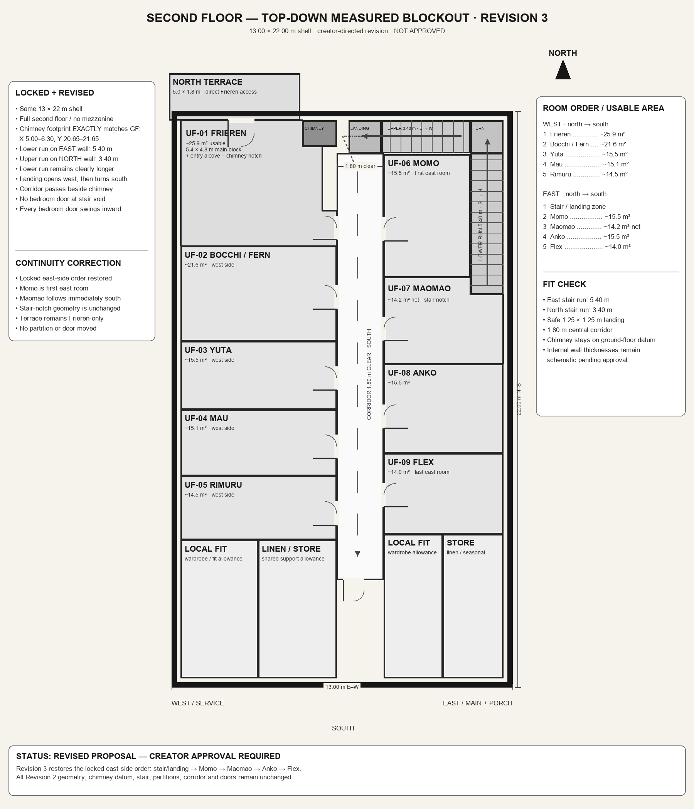

# The Arrivals — Inn Second-Floor Measured Production Plan v0.1

**Status:** CREATOR-APPROVED SPATIAL PRODUCTION LOCK  
**Date:** 2026-09-20  
**Authority:** `THE_ARRIVALS_ABANDONED_VILLAGE_AND_INN_SPATIAL_BIBLE_v0.6.md`  
**Supersedes:** preliminary upper-floor fit diagrams, rejected upper-floor perspectives, and the v0.5 deferred-detail note

## Drawing convention

- Southwest exterior corner = `(0,0)`; east is `+X`, north is `+Y`.
- Exterior shell = `13.00 × 22.00 m`.
- Clear interior envelope = approximately `12.30 × 21.30 m`.
- Full continuous second floor; no mezzanine and no double-height common-room void.
- The attached PNG is the approved creator-review drawing. This coordinate schedule is its measured textual authority.

## Fixed vertical anchors

- Chimney stack: `X 5.00–6.30`, `Y 20.65–21.65`; exact ground-floor datum preserved.
- Lower physical stair: east wall, rises south → north; ground-floor first tread remains at `Y 15.35`.
- Second-floor stairwell/headroom opening: `X 11.40–12.65`, `Y 15.00–20.40`.
- Northeast turn: `X 11.40–12.65`, `Y 20.40–21.65`.
- Upper run: `X 8.00–11.40`, `Y 20.40–21.65`, rises east → west.
- Compact landing: `X 6.75–8.00`, `Y 20.40–21.65`.
- The `0.35 m` southward extension of the upper opening is a headroom/opening allowance. It does not relocate the ground-floor entry or first tread.
- Landing and corridor pass beside the chimney, never through it.

## Corridor

- Central corridor: `X 6.30–8.10`, `Y 4.10–20.40`.
- Clear width: `1.80 m`.
- The landing opens west into the north corridor transition, which then turns south.
- The corridor terminates before Frieren's private north-end/terrace relationship and never becomes a second hallway.

## West side — north → south

| ID | Room | Clear bounds / geometry | Usable area |
|---|---|---|---:|
| UF-01 | Frieren | north-end polygon; `5.4 × 4.8 m` main block plus entry alcove minus chimney notch | `~25.9 m²` |
| UF-02 | Bocchi / Fern | `X 0.35–6.30`, `Y 13.22–16.85` | `~21.6 m²` |
| UF-03 | Yuta | `X 0.35–6.30`, `Y 10.61–13.22` | `~15.5 m²` |
| UF-04 | Mau | `X 0.35–6.30`, `Y 8.07–10.61` | `~15.1 m²` |
| UF-05 | Rimuru | `X 0.35–6.30`, `Y 5.63–8.07` | `~14.5 m²` |

Frieren's approved polygon is `(0.35,16.85) → (6.30,16.85) → (6.30,18.20) → (5.75,18.20) → (5.75,20.65) → (5.00,20.65) → (5.00,21.65) → (0.35,21.65)`.

## East side — north → south

| ID | Room | Clear bounds / geometry | Usable area |
|---|---|---|---:|
| — | Stair / landing | fixed L-shaped opening and compact landing | — |
| UF-06 | Momo | `X 8.10–11.40`, `Y 15.65–20.35` | `~15.5 m²` |
| UF-07 | Maomao | `X 8.10–12.65`, `Y 12.35–15.65`, minus stair/headroom notch `X 11.40–12.65`, `Y 15.00–15.65` | `~14.2 m² net` |
| UF-08 | Anko | `X 8.10–12.65`, `Y 8.94–12.35` | `~15.5 m²` |
| UF-09 | Flex | `X 8.10–12.65`, `Y 5.86–8.94` | `~14.0 m²` |

## Frieren north-end lock

- North terrace: approximately `5.0 × 1.8 m`, spanning the north exterior directly from Frieren's block.
- Terrace access is inside Frieren's room; the landing is not part of the terrace and cannot separate Frieren from it.
- Chimney remains a notch at Frieren's north/east architectural end.
- Frieren is the first natural west-side room access after reaching the upper floor.

## Door safety lock

- Every bedroom door swings inward.
- No bedroom door opens into the stair void.
- Approved west-side door positions are on `X 6.30` at the room bands shown in the drawing.
- Approved east-side door positions are on `X 8.10` at the room bands shown in the drawing.
- Frieren's terrace door is on the north wall inside her private block.
- Later renders may crop doors naturally but may not move, duplicate, or invent them.

## Production use

- This plan is hard geometry authority for Upper-Floor Baseline A/B and later upper-floor scenes.
- Perspective renders must be treated as cameras inside one immutable set.
- The approved CAL-02/CAL-03 ground-floor set remains the vertical continuity authority below.
- Style references may influence line, value, materials, damage, and atmosphere only; they may not alter this geometry.
